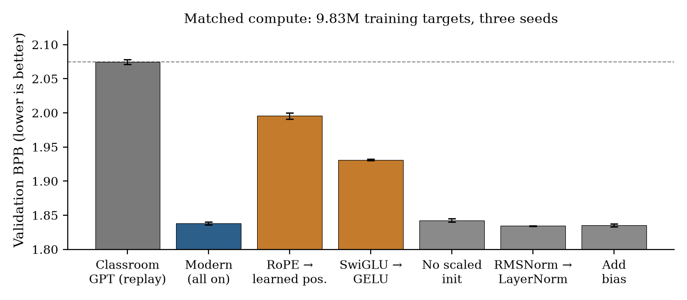
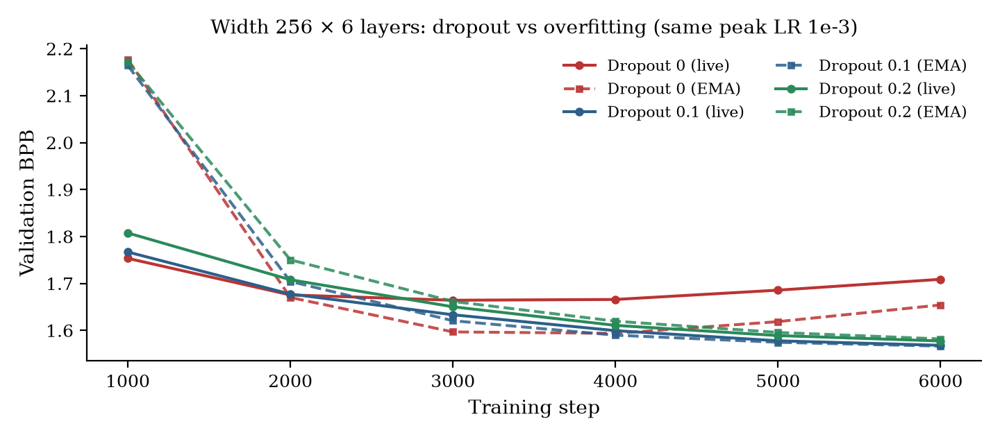
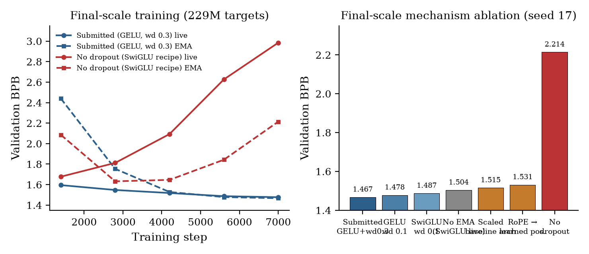

# DASE7506 MP1 Report: A Regularised Modern GPT under a Strict Evaluation Budget

**Student ID:** 3036837930  
**GitHub:** [zss019/DASE7506-Project-1](https://github.com/zss019/DASE7506-Project-1)  
**Score issue:** [#107](https://github.com/xudongwu-0/xudongwu-0.github.io/issues/107)  
**Protocol:** `7506-mp1-wt2-v2`  
**Reported full-test FP32 BPB:** **1.48544** (evaluator JSON: 1.485441599903059)

---

## 1. Introduction

The assignment is to train a language model from random initialisation on the supplied WikiText-2 splits and BPE-2048 tokenizer, then minimise *bits per byte* (BPB) on the frozen test split. Evaluation uses independent causal windows of 256 tokens, FP32, and must remain reproducible on CPU. The resource cap is at most five times the classroom baseline’s CPU scoring time, 4 GiB peak evaluation RAM, and 64 MiB of uncompressed inference assets. The starter GPT (width 128, four layers, four heads, 1.09 M parameters) scores about 2.10 test BPB.

This report documents one submitted predictor and the evidence required by the guide: a reproduced baseline; a comparison at the *same number of processed training targets*; an ablation of the mechanisms that actually move BPB; and a critical account of quality–cost trade-offs. All architecture and hyperparameter choices were made on **validation**. The test split was scored only after a method was frozen. Three such freezes occurred; Section 7 lists them so that the score is auditable.

## 2. Method

### 2.1 Model

The submitted model is a decoder-only Transformer with the same interfaces as the starter (`forward` logits and `predict_log_probs` normalised log-probabilities; `context=256`; vocabulary 2048). The factory is `student.py`. Relative to `model.py` the block is:

- **RMSNorm** instead of LayerNorm, and **no linear biases**.
- **Rotary position embeddings (RoPE)** instead of a learned absolute position table.
- A **GELU MLP** with hidden width \(4\times d\), matching the baseline FFN family rather than a gated SwiGLU.
- **Dropout 0.2** on token embeddings, attention, and residual branches (training only).
- **GPT-2-style residual-output initialisation**, \(\sigma=0.02/\sqrt{2L}\).
- Tied input and output embeddings (already in the baseline).

The submitted size is \(d=256\), \(L=8\), 4 heads: **6 820 096** parameters (26.0 MiB checkpoint). Evaluation is stateless: each window is an independent forward pass. There is no retrieval index, neural cache, or cross-window memory.

### 2.2 Training

Training uses the supplied `train.py` with additional, default-off flags. The submitted recipe (seed **17**, pre-specified and not selected after seeing other seeds) is:

| Setting | Value |
|---|---|
| Device / precision | CUDA, BF16 autocast |
| Steps \(\times\) batch \(\times\) context | \(7000\times 128\times 256\) |
| Processed targets | 229 376 000 (\(\approx 63\) epochs of the 3.61 M-token train split) |
| Optimiser | AdamW, \(\beta=(0.9,0.999)\), grad clip 1.0 |
| Peak LR / warmup / cosine floor | \(4\times 10^{-3}\) / 300 steps / 2% of peak |
| Weight decay | 0.3, **excluding** 1-D parameters (norm gains) |
| EMA | 0.9995; the EMA copy is validated and saved |

The checkpoint stores protocol, `implementation=student`, config, and weights. It does not store the optimiser. RoPE cosine/sine tables are rebuilt at load time (`persistent=False`).

## 3. Reproduced baseline

The official recipe (`model.py`, `configs/baseline.json`, 1 200 steps, batch 32, seed 17, AdamW LR \(10^{-3}\), 100-step warmup, cosine to 10% of peak) was run on CPU with four threads, as in the code README.

| Split | BPB | Token PPL | Parameters | Train tokens |
|---|---:|---:|---:|---:|
| Validation | 2.0711 | 79.5 | 1 088 256 | 9 830 400 |
| **Test (CPU FP32)** | **2.10126** | 80.8 | same | same |

This matches the advertised \(\approx 2.10\) test BPB. Scoring took 7.5 s on the development CPU (Xeon Gold 6248, shared host); peak RSS was 2.11 GiB. GPU replays of the *same architecture and token budget* (Section 4) give validation BPB \(2.0747\pm 0.0037\) over three seeds, so the CPU/GPU gap is noise.

## 4. Matched-token comparison and architecture ablation

The guide asks for a comparison at the same number of processed training targets, and an ablation of the key mechanism. One paired sweep covers both.

Keeping 1 200 steps \(\times\) 32 \(\times\) 256 \(= 9.83\) M targets, seed \(\in\{17,18,19\}\), and the baseline optimiser, each architectural switch was turned on or off independently. `student_as_baseline` is bitwise-equivalent to `model.py` at initialisation (zero logit difference under a shared seed). Table 1 and Figure 1 summarise validation BPB.

**Table 1.** Validation BPB at 9.83 M targets (mean \(\pm\) sample SD, three seeds). \(\Delta\) is paired against `student_modern`.

| Config | Params | Val. BPB | \(\Delta\) vs modern |
|---|---:|---:|---:|
| Classroom GPT (`student_as_baseline`) | 1 088 256 | \(2.0747\pm 0.0037\) | \(+0.237\) |
| **Modern (RMSNorm+RoPE+SwiGLU, no bias, scaled init)** | 1 049 216 | \(1.8379\pm 0.0021\) | 0 |
| RoPE \(\to\) learned positions | 1 081 984 | \(1.9955\pm 0.0047\) | \(+0.158\) |
| SwiGLU \(\to\) GELU | 1 049 728 | \(1.9311\pm 0.0010\) | \(+0.093\) |
| No residual scaled init | 1 049 216 | \(1.8426\pm 0.0022\) | \(+0.005\) |
| RMSNorm \(\to\) LayerNorm | 1 050 368 | \(1.8343\pm 0.0002\) | \(-0.004\) |
| Add biases | 1 054 504 | \(1.8353\pm 0.0024\) | \(-0.003\) |

**What this establishes.** Under a *short* pass over a 3.6 M-token corpus, replacing the starter block with a modern block cuts validation BPB by **0.24**, far larger than seed scatter (\(\mathrm{SD}\approx 0.002\)–\(0.005\)). The two mechanisms that explain almost all of that gap are:

1. **RoPE (\(\approx 0.16\) BPB).** A learned \(256\times d\) position table must be estimated from few unique windows; late positions are rare. RoPE encodes *relative* offset in the attention logits with no extra parameters, which is a better inductive bias when data are scarce.
2. **SwiGLU (\(\approx 0.09\) BPB).** At matched parameter count (hidden width \(8/3\,d\) vs \(4d\) GELU), a gated MLP is a more efficient feed-forward nonlinearity—on this *short* schedule.

Scaled residual init is a small, stable gain (\(\approx 0.005\), about 3\(\times\) the paired SD). RMSNorm versus LayerNorm, and removing bias, are **not** distinguishable from noise at this size; LayerNorm is even slightly better. Those two knobs were therefore treated as optional modern defaults, not as claimed contributions.

CPU scoring of the modern 1.05 M model was 7.2 s versus 6.4 s for the baseline on the same host: RoPE adds a rotation, but the ratio is \(\approx 1.1\times\), far inside the \(5\times\) cap.

## 5. Scaling, regularisation, and the training recipe

WikiText-2 is small. The matched-token modern model is still under capacity. The remaining budget (CPU time, 64 MiB, 4 GiB RAM) was used to scale width/depth and to train longer, with regularisation to fight the resulting overfitting.

### 5.1 Dropout is not optional once training is long

Figure 2 holds architecture at width 256 \(\times\) 6 layers and varies dropout over 6 000 steps (EMA 0.999). With dropout 0 the *live* validation BPB bottoms near step 3 000–4 000 (\(\approx 1.66\)) and then **rises**; EMA conceals part of the rise but still degrades after step 4 000. Dropout 0.1 continues to fall to 1.566. Dropout 0.2 is slightly worse at this short horizon (underfitting) but becomes the better regulariser at the final length (Section 6).

### 5.2 Shape and compute

Untrained configs were timed with the supplied FP32 scorer (CPU, 4 threads, interleaved with the baseline to reduce load effects). Width 256 \(\times\) 8 layers is about **3.4–3.7\(\times\)** baseline time and 26 MiB: inside the cap with a margin for a busy host. Width 384 \(\times\) 6 was \(\approx 4.8\times\) and was rejected. At 10 000 steps, dropout 0.2, 256\(\times\)8 beat 320\(\times\)6 and 384\(\times\)4; 192\(\times\)12 and 224\(\times\)10 also lost to 256\(\times\)8. Four heads beat eight heads at the same width. **Depth at moderate width** was the efficient direction, not width or extra heads.

### 5.3 Optimiser-scale choices (validation only)

Around 256\(\times\)8, batch 128 with peak LR \(4\times 10^{-3}\) outperformed batch 64 / LR \(3\times 10^{-3}\) at the same token count and trained faster. EMA 0.9995 with a cosine floor of 2% of peak beat EMA 0.999 / floor 10%. Extending from 5 000 to 7 000 steps at batch 128 helped by \(\approx 0.003\) BPB; 9 000–14 000 steps added little or hurt when regularisation was too weak. Dropout 0.3 and dropout 0.25 + weight decay 0.2 underfitted.

After switching the FFN to GELU (Section 6), a dedicated pass on **weight decay** found 0.3 better than 0.1 or 0.2, with 0.4 on a plateau. Three seeds at weight decay 0.3:

| Seed | Val. BPB (EMA) | Live weights |
|---:|---:|---:|
| 17 (submitted) | **1.4672** | 1.4769 |
| 18 | 1.4661 | 1.4773 |
| 19 | 1.4723 | 1.4823 |
| Mean \(\pm\) SD | \(1.4685\pm 0.0033\) | |

Seed 17 was fixed before this sweep; it is not the best of the three.

## 6. Final-scale ablation and the SwiGLU reversal

At the *submitted token budget* (229 M targets, batch 128, LR \(4\times 10^{-3}\), EMA 0.9995, dropout 0.2, seed 17), mechanisms were removed one at a time (Figure 3, right). Table 2 reports EMA validation BPB unless noted.

**Table 2.** Final-scale paired ablations (229 M targets, seed 17).

| Variant | Val. BPB | vs SwiGLU run |
|---|---:|---:|
| SwiGLU, wd 0.1 (previous freeze) | 1.4870 | 0 |
| Same run, **no EMA** (live weights) | 1.5036 | \(+0.017\) |
| RoPE \(\to\) learned positions | 1.5311 | \(+0.044\) |
| Entire block \(\to\) scaled classroom GPT | 1.5153 | \(+0.028\) |
| Dropout 0 | 2.214 (live 2.985) | \(+0.73\) |
| **SwiGLU \(\to\) GELU**, wd 0.1 | **1.4779** | \(-0.009\) |
| GELU, **wd 0.3** (submitted) | **1.4672** | \(-0.020\) |

**Dropout** is the dominant regulariser: without it the live model diverges after \(\approx 1.4\)k steps (Figure 3, left). **EMA** is a cheap averaging of the optimisation path and is worth \(\approx 0.01\)–\(0.017\) BPB at this scale; it is a training-time copy, not a test-time ensemble, so scoring cost is unchanged. **RoPE** remains helpful but the gain shrinks from 0.16 (short training) to 0.04 (long training): more epochs let a learned table catch up, yet not completely. Replacing the whole modern block by a *scaled* classroom GPT (LayerNorm, learned positions, GELU, biases, no scaled init), trained with the *same* recipe, lands at 1.515: most of the journey from 2.07 to 1.47 is **scale + schedule + dropout + EMA**, not the block design.

**SwiGLU reverses sign.** At 9.83 M tokens SwiGLU won by 0.09; at 229 M tokens with dropout 0.2, GELU wins by \(\approx 0.014\) on average over three seeds (GELU \(1.4765\pm 0.0026\) vs SwiGLU \(1.4904\pm 0.0036\)). A gated MLP is a higher-capacity FFN; once the model is large and the data are seen \(\approx 60\) times, that extra capacity overfits even with dropout. This is a negative result worth reporting: “modern defaults” are not uniformly better under a small-corpus, high-epoch regime.

GELU + weight decay 0.3 is the submitted method. It does not change scoring time relative to the SwiGLU 256\(\times\)8 checkpoint.

## 7. Test protocol, resources, and search cost

### 7.1 Freeze-then-test log

The guide requires freezing before testing. Test was evaluated **three** times, each after a validation-driven freeze. Hyperparameters were never fitted to test BPB. The ordering of the three methods is the same on validation and on test (gap \(\approx 0.018\)–\(0.019\)):

| Freeze | Selection (val. BPB) | Test BPB | Checkpoint SHA-256 (prefix) |
|---|---:|---:|---|
| 1. SwiGLU, wd 0.1 | 1.4870 | 1.50581 | `4f8cafd2…` |
| 2. GELU, wd 0.1 | 1.4779 | 1.49652 | `72331989…` |
| **3. GELU, wd 0.3 (submitted)** | **1.4672** | **1.48544** | `de648427…` |

The submitted file is `checkpoint.pt` at [Release v3](https://github.com/zss019/DASE7506-Project-1/releases/download/v3/checkpoint.pt).

### 7.2 Evaluation budget (same frozen predictor)

| Limit | Submitted | Cap |
|---|---:|---:|
| CPU scoring vs local baseline | \(\approx 3.4\)–\(4.1\times\) (load-dependent; quieter host \(\approx 3.4\times\)) | \(\le 5\times\) |
| Peak RSS | 2.10 GiB | \(\le 4\) GiB |
| Uncompressed assets | 26.0 MiB file (28 MiB if tied embeddings are counted twice in `state_dict`) | \(\le 64\) MiB |

RAM is dominated by the tokenizer, dataset tensors, and the PyTorch runtime; enlarging the net from 1.1 M to 6.8 M parameters barely moved RSS. The unused time margin (\(\approx 1\times\) baseline) was left on purpose: 9-layer and \(5\times\)-MLP variants were slower and *worse* or equal on validation.

### 7.3 Training and search cost

Development used one RTX 3080 Ti (12 GiB). About **68** recorded GPU training runs sum to **29 800 s \(\approx 8.3\) GPU-hours** of job time (many overlapped on one GPU, so wall-clock was shorter). Additional CPU time: the official 1 200-step baseline (\(\approx 7\) min), repeated scorer timings, and all ranked FP32 evaluations. No external text, no pretrained weights, no paid API.

## 8. Critical analysis

**What worked.** (i) RoPE is the one architectural change that helped at *both* token budgets. (ii) Dropout plus a long cosine schedule is what makes a 6.8 M model viable on 3.6 M tokens. (iii) EMA is a one-line, zero-inference-cost improvement that should be in any ablation table because the trainer already holds the live weights. (iv) GELU + stronger weight decay beat a fashionable gated MLP once training was long—an empirical correction, not a slogan.

**What did not.** RMSNorm and dropping bias did not matter at 1 M parameters and were not re-litigated as “wins.” Extra heads, extra width at fixed time, and simply training longer without more decay all failed. A 9-layer net used more of the \(5\times\) budget for no validation gain: **the bottleneck is data, not FLOPs.**

**Trade-off.** Moving from the 1.05 M modern GPT (val. 1.84) to the 6.8 M submitted model (val. 1.47) costs about \(3\times\) scoring time and \(6\times\) parameters, still inside the cap. Further scale would spend the remaining \(1\times\) time for a likely sub-0.01 BPB and a higher overfitting risk. Test-time tricks that the starter interface allows (a *within-window* neural cache) were not used; they might recover some of the 0.01–0.02 left on the table without new weights, at a small compute cost that would need a fresh timing.

**Limitations.** Three test evaluations after successive freezes are more than a single-shot protocol; they are disclosed and were not used as a fitting signal. Several late ablations used a single seed; the GELU and weight-decay conclusions were replicated on seeds 18 and 19. The CPU time ratio is host-load dependent; the architecture ratio measured on a quieter interval is \(\approx 3.4\times\). Substantive implementation and drafting help from a coding agent (Cursor Grok 4.6) is disclosed in the repository README.

## 9. Conclusion

The submitted predictor is a 256-wide, 8-layer causal GPT with RMSNorm, RoPE, GELU, dropout 0.2, and EMA weights, trained for 229 M targets with AdamW weight decay 0.3. It scores **1.48544** full-test FP32 BPB against a reproduced baseline of **2.10126**, within the three evaluation limits. The matched-token study isolates RoPE and (under short training) SwiGLU; the final-scale study shows that **regularisation and training length dominate architecture**, and that SwiGLU *hurts* once the model is large. Those two controls together satisfy the guide’s evidence requirement.

## References

1. Radford, A. et al. *Language Models are Unsupervised Multitask Learners.* OpenAI (2019). Residual scaling as used in GPT-2.
2. Su, J. et al. RoFormer: Enhanced Transformer with Rotary Position Embedding. *Neurocomputing* (2024 / arXiv:2104.09864).
3. Zhang, B. and Sennrich, R. Root Mean Square Layer Normalization. *NeurIPS* (2019).
4. Shazeer, N. GLU Variants Improve Transformer. arXiv:2002.05202 (2020).
5. Loshchilov, I. and Hutter, F. Decoupled Weight Decay Regularization. *ICLR* (2019).
6. Polyak, B. T. and Juditsky, A. B. Acceleration of Stochastic Approximation by Averaging. *SIAM J. Control Optim.* (1992).
7. Merity, S. et al. Pointer Sentinel Mixture Models. *ICLR* (2017). WikiText-2.
8. Course package: DASE7506 MP1 starter (`model.py`, `train.py`, `evaluate.py`), protocol `7506-mp1-wt2-v2`.
